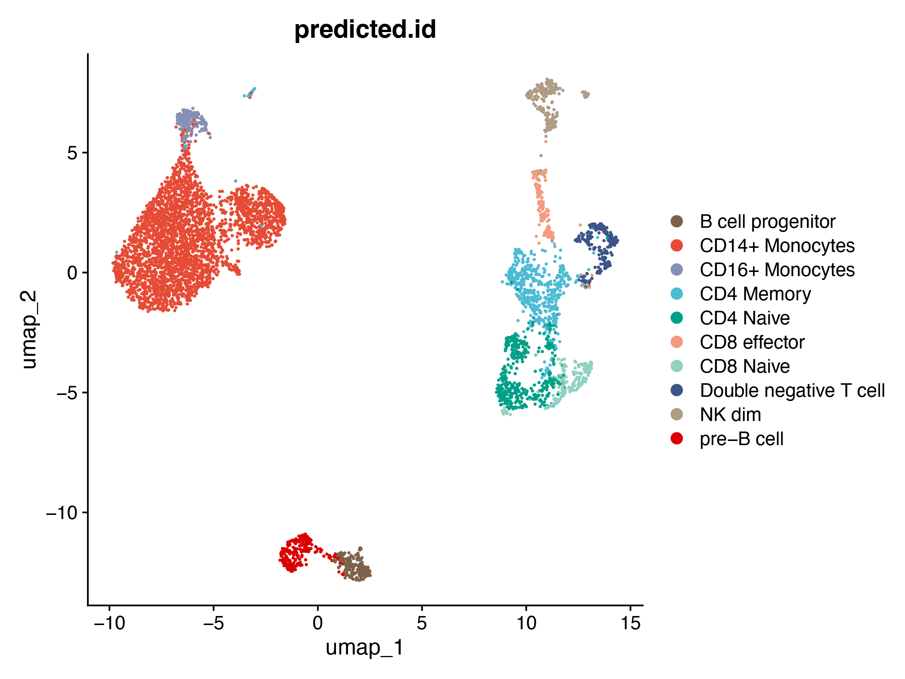
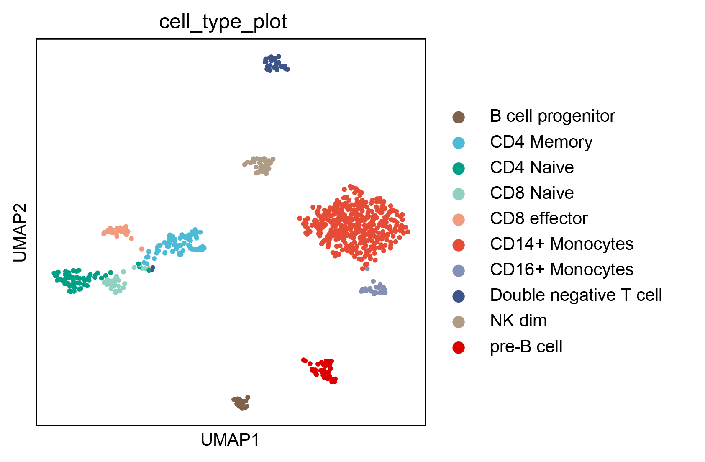

# Hi-Compass Advanced Tutorial

This tutorial provides advanced analysis workflows for cell-type-specific Hi-C data predicted by Hi-Compass. 

For installation, data preprocessing, model training, and basic prediction usage, please refer to the main [README](https://github.com/EndeavourSyc/Hi-Compass/blob/main/README.md).

## Contents

- [Meta-cell Hi-C Prediction](#meta-cell-hi-c-prediction) - Aggregate single-cell ATAC-seq into meta-cells and predict mcHi-C for each cell type
- [mcHi-C Clustering](#mchi-c-clustering) - Perform dimensionality reduction and clustering on predicted mcHi-C matrices
- [Loop Detection](#loop-detection) - Call chromatin loops and differential loops using Mustache
- [Promoter-Enhancer Annotation](#promoter-enhancer-annotation) - Annotate detected loops as potential promoter-enhancer interactions
- [GWAS Variant Annotation](#gwas-variant-annotation) - Link GWAS variants to target genes by identifying loops with both anchors overlapping GWAS-associated regions

## 1. Meta-cell Hi-C Prediction

We demonstrate Hi-Compass meta-cell Hi-C prediction using a single-cell ATAC-seq dataset of human peripheral blood mononuclear cells (PBMCs) from 10x Genomics. 

The workflow consists of three steps:
1. Aggregate single cells into meta-cells
2. Generate ATAC-seq BigWig files for each meta-cell
3. Predict Hi-C contact matrices using Hi-Compass

### 1.1 Prepare the Annotated scATAC-seq Object

Follow the [Signac PBMC vignette](https://stuartlab.org/signac/articles/pbmc_vignette) to obtain an annotated Seurat/Signac object with cell type annotations.

You can also download the processed pbmc_filtered.rds file from [here](https://wulab.bjmu.edu.cn/hicompass_download/pbmc_filtered.rds) .

```R
library(Seurat)
library(ggplot2)
library(dplyr)
library(glue)

pbmc_filtered <- readRDS('pbmc_filtered.rds')
DimPlot(
  object = pbmc_filtered,
  group.by = 'predicted.id',
  label = TRUE,
  repel = TRUE) + ggtitle('predicted.id')
```



### 1.2 Meta-cell Aggregation

We provide two methods for aggregating single cells into meta-cells:

#### Method A: K-means Clustering (Recommended)

This method aggregates cells based on their proximity in UMAP space, ensuring that cells within each meta-cell are transcriptionally similar.
```R
ct_list <- unique(data.frame(pbmc_filtered$predicted.id)[,1])
split_objects <- SplitObject(pbmc_filtered, split.by = "predicted.id")

cluster_size <- 10
threshold_low <- cluster_size * 0.5
threshold_up <- cluster_size * 2

total_df <- data.frame()
for (ct in ct_list) {
    cache_object <- split_objects[[ct]]
    cell_num <- length(cache_object$predicted.id)
    
    # Skip cell types with too few cells
    if (cell_num < cluster_size * 5) {
        next
    }
    
    # K-means clustering on UMAP coordinates
    umap_axis <- cache_object@reductions$umap@cell.embeddings
    k <- cell_num %/% cluster_size + 1
    kmeans_result <- kmeans(umap_axis, centers = k) 
    
    cluster_assignments <- data.frame(
        cluster = glue("{ct}~{kmeans_result$cluster}"),
        barcode = rownames(umap_axis)
    )
    
    # Get cluster sizes
    cluster_sizes <- cluster_assignments %>%
        group_by(cluster) %>%
        summarise(count = n()) %>%
        ungroup()
    
    # Keep clusters within size thresholds
    small_clusters_df <- cluster_sizes %>%
        filter(count >= threshold_low & count <= threshold_up) %>%
        left_join(cluster_assignments, by = 'cluster') %>%
        select(-count)
    
    # Split large clusters
    large_clusters <- cluster_sizes %>%
        filter(count > threshold_up)
    
    split_large_df <- data.frame(cluster = character(), barcode = character())
    
    if (nrow(large_clusters) > 0) {
        for (i in 1:nrow(large_clusters)) {
            large_cluster_name <- large_clusters$cluster[i]
            large_cluster_count <- large_clusters$count[i]
            n_splits <- ceiling(large_cluster_count / cluster_size)
            
            large_cluster_barcodes <- cluster_assignments[
                cluster_assignments$cluster == large_cluster_name, ]
            
            if (nrow(large_cluster_barcodes) > 0 && n_splits > 0) {
                all_splits <- sample(rep(1:n_splits, length.out = nrow(large_cluster_barcodes)))
                large_cluster_barcodes$split <- all_splits
                
                for (split_num in 1:n_splits) {
                    current_split <- large_cluster_barcodes[
                        large_cluster_barcodes$split == split_num, ]
                    if (nrow(current_split) > 0) {
                        current_split$cluster <- glue("{large_cluster_name}{split_num}")
                        split_large_df <- rbind(
                            split_large_df, 
                            current_split[, c("cluster", "barcode")]
                        )
                    }
                }
            }
        }
    }
    
    # Combine results
    if (nrow(split_large_df) > 0) {
        cache_df <- rbind(small_clusters_df, split_large_df)
    } else {
        cache_df <- small_clusters_df
    }
    
    total_df <- rbind(total_df, cache_df)
}

# Save meta-cell assignments
write.table(
    total_df[, c('barcode', 'cluster')], 
    'barcode_cluster.csv',
    quote = FALSE, 
    row.names = FALSE, 
    col.names = FALSE, 
    sep = " "
)
```

#### Method B: Fixed-size Aggregation

If you prefer strict control over the number of cells per meta-cell without considering neighborhood relationships, use this simpler approach:
```R
ct_list <- unique(data.frame(pbmc_filtered$predicted.id)[,1])

cluster_size <- 10

total_df <- data.frame()
for (ct in ct_list) {
    # Get all barcodes for this cell type
    barcodes <- colnames(pbmc_filtered)[pbmc_filtered$predicted.id == ct]
    
    # Randomize order
    barcodes <- sample(barcodes)
    
    # Calculate number of complete groups
    n_cells <- length(barcodes)
    n_groups <- n_cells %/% cluster_size
    
    if (n_groups == 0) next
    
    # Use only cells that fit into complete groups (discard remainder)
    barcodes_use <- barcodes[1:(n_groups * cluster_size)]
    
    # Assign cluster IDs
    cluster_ids <- rep(1:n_groups, each = cluster_size)
    
    cache_df <- data.frame(
        barcode = barcodes_use,
        cluster = glue("{ct}~{cluster_ids}")
    )
    
    total_df <- rbind(total_df, cache_df)
}

# Save meta-cell assignments
write.table(
    total_df[, c('barcode', 'cluster')], 
    'barcode_cluster.csv',
    quote = FALSE, 
    row.names = FALSE, 
    col.names = FALSE, 
    sep = " "
)
```

The output `barcode_cluster.csv` contains two columns: barcode and meta-cell ID.
```R
head(total_df)
```
```
# A tibble: 6 × 2
  cluster           barcode           
  <glue>            <chr>             
1 CD14+ Monocytes~1 AACCTTTCAGATACAA-1
2 CD14+ Monocytes~1 AACTGTGAGCCGCTGT-1
3 CD14+ Monocytes~1 ACTAACGTCACCGCGA-1
4 CD14+ Monocytes~1 ATCGAGTGTTGGCTAT-1
5 CD14+ Monocytes~1 CACATGAGTGATAACA-1
6 CD14+ Monocytes~1 CCTTAATTCCATCTAT-1
```

### 1.3 Extract BAM Files for Each Meta-cell

Use [Sinto](https://github.com/timoast/sinto) to subset the Cell Ranger ATAC output BAM file by meta-cell assignments:
```bash
sinto filterbarcodes \
    -b possorted_bam.bam \
    -c barcode_cluster.csv \
    -p 16 \
    -s \
    --outdir ./meta_cell/
```

This command takes approximately one hour depending on computational resources.

### 1.4 Convert to BigWig and Calculate Depth

After extracting SAM files, convert each meta-cell's reads to BigWig format and record the sequencing depth:
```bash
#!/bin/bash

BASE_DIR="./meta_cell/"
CHROM_SIZES="/path/to/hg38.chrom.sizes"

for SAM_FILE in "$BASE_DIR"/*.sam; do
    # Get filename without path and extension
    BASENAME=$(basename "$SAM_FILE" .sam)
    
    # Create subdirectory for this meta-cell
    OUT_DIR="$BASE_DIR/$BASENAME"
    mkdir -p "$OUT_DIR"
    
    # Move SAM file to subdirectory
    mv "$SAM_FILE" "$OUT_DIR/"
    
    cd "$OUT_DIR"
    
    # 1. Count depth
    wc -l "$BASENAME.sam" > "$BASENAME.txt"
    
    # 2. SAM to BAM
    samtools view -bS "$BASENAME.sam" -o "$BASENAME.bam"
    
    # 3. Sort BAM
    samtools sort "$BASENAME.bam" -o "$BASENAME.sorted.bam"
    
    # 4. BAM to bedGraph
    bedtools genomecov -ibam "$BASENAME.sorted.bam" -bg > "$BASENAME.bedgraph"
    
    # 5. Filter to keep only chr1-22 (for human; use chr1-19 for mouse)
    awk '$1 ~ /^chr([1-9]|1[0-9]|2[0-2])$/' "$BASENAME.bedgraph" > "$BASENAME.sorted.bedgraph"
    
    # 6. bedGraph to BigWig
    bedGraphToBigWig "$BASENAME.sorted.bedgraph" "$CHROM_SIZES" "$BASENAME.bw"
    
    # Clean up intermediate files
    rm -f "$BASENAME.sam" "$BASENAME.bam" "$BASENAME.sorted.bam" "$BASENAME.bedgraph" "$BASENAME.sorted.bedgraph"
    
    cd "$BASE_DIR"
done

echo "All processing complete!"
```

### 1.5 Predict mcHi-C

Run Hi-Compass prediction for each meta-cell:
```bash
#!/bin/bash

BASE_DIR="./meta_cell/"
MODEL_PATH="/path/to/hicompass_hg38.pth"
CTCF_PATH="/path/to/generalized_CTCF.bw"
DNA_DIR="/path/to/DNA/hg38"
CENTROMERE_BED="/path/to/centromere.bed"

for DIR in "$BASE_DIR"/*; do
    if [ -d "$DIR" ]; then
        DIR_NAME=$(basename "$DIR")
        BW_FILE="$DIR/$DIR_NAME.bw"
        DEPTH_FILE="$DIR/$DIR_NAME.txt"
        
        if [ -f "$BW_FILE" ] && [ -f "$DEPTH_FILE" ]; then
            DEPTH=$(awk '{print $1}' "$DEPTH_FILE")
            
            echo "Processing $DIR_NAME (depth: $DEPTH)..."
            
            hicompass predicting \
                --model-path "$MODEL_PATH" \
                --atac-path "$BW_FILE" \
                --ctcf-path "$CTCF_PATH" \
                --dna-dir "$DNA_DIR" \
                --centromere-bed "$CENTROMERE_BED" \
                --depth "$DEPTH" \
                --genome hg38 \
                --output "$DIR/$DIR_NAME.cool" \
                --device cuda:0
            
            echo "Completed $DIR_NAME"
        fi
    fi
done

echo "Prediction complete!"
```

## 2. mcHi-C Dimensionality Reduction and Clustering

After predicting mcHi-C for all meta-cells, we use scanpy to perform dimensionality reduction and clustering on the predicted contact matrices. This allows us to visualize cell-type-specific chromatin organization patterns.

### 2.1 Extract Diagonal Features from mcHi-C

We flatten each mcHi-C matrix by extracting diagonal bands, which capture interaction frequencies at different genomic distances. By default, we use diagonals 2-20 (corresponding to 20-200 kb genomic distances at 10 kb resolution).
```python
import os
import cooler
import numpy as np
import pandas as pd
import scanpy as sc


def extract_diagonal_features(folder_path, 
                              start_diag=2, 
                              end_diag=20, 
                              chroms=[f'chr{i}' for i in range(1, 23)]):
    """
    Extract diagonal features from mcHi-C cool files for clustering.
    
    Parameters
    ----------
    folder_path : str
        Directory containing meta-cell subdirectories with .cool files
    start_diag : int
        Starting diagonal index (default: 2, skipping the main diagonal and first off-diagonal)
    end_diag : int
        Ending diagonal index (default: 20)
    chroms : list
        List of chromosomes to include
    
    Returns
    -------
    features : np.ndarray
        Feature matrix (n_cells x n_features)
    cell_names : list
        Meta-cell identifiers
    """
    features = []
    cell_names = []
    
    for subdir in os.listdir(folder_path):
        cool_path = os.path.join(folder_path, subdir, f'{subdir}.cool')
        
        if not os.path.exists(cool_path):
            continue
        
        try:
            clr = cooler.Cooler(cool_path)
            print(f'Processing: {cool_path}')
            
            # Extract cell type from directory name
            cell_type = subdir.split('~')[0]
            
            # Extract diagonals for each chromosome
            chrom_diagonals = {}
            for chrom in chroms:
                matrix = clr.matrix(balance=False).fetch(chrom)
                chrom_diagonals[chrom] = [
                    matrix.diagonal(i) for i in range(start_diag, end_diag)
                ]
            
            # Concatenate all diagonals into a single feature vector
            feature_vector = []
            for diag_idx in range(end_diag - start_diag):
                for chrom in chroms:
                    feature_vector.extend(chrom_diagonals[chrom][diag_idx])
            
            features.append(feature_vector)
            cell_names.append(cell_type)
            
        except Exception as e:
            print(f'Error processing {cool_path}: {str(e)}')
    
    return np.array(features), cell_names
```

### 2.2 Perform Clustering with Scanpy
```python
# Extract features
folder_path = './meta_cell/'
features, cell_names = extract_diagonal_features(folder_path)

# Create AnnData object
adata = sc.AnnData(pd.DataFrame(features).fillna(0))
adata.obs['cell_type'] = cell_names

# Standard scanpy workflow
sc.pp.scale(adata)
sc.tl.pca(adata)
sc.pp.neighbors(adata)
sc.tl.umap(adata)
sc.tl.leiden(adata, resolution=0.7)

# Visualize results
sc.pl.umap(adata, color=['cell_type',])
```



### 2.3 Notes on Parameter Selection

| Parameter    | Recommendation | Description                                                  |
| ------------ | -------------- | ------------------------------------------------------------ |
| `start_diag` | 2              | Skip main diagonal (0) and first off-diagonal (1) which contain only zeros in Hi-Compass predictions |
| `end_diag`   | 20-100         | Higher values capture longer-range interactions but increase memory usage |
| `resolution` | 0.1-1.0        | Leiden clustering resolution; adjust based on expected number of cell types |

Increasing the number of diagonals (`end_diag`) will capture more long-range interaction patterns but requires more memory and computation time. We recommend using at least 15 diagonals to capture differential features of mcHi-C data.


## 3. Loop Detection

We recommend using [Mustache](https://github.com/ay-lab/mustache) for calling chromatin loops from Hi-Compass predicted mcHi-C data. Mustache provides two modes: single-sample loop calling and differential loop detection between two conditions.

### 3.1 Aggregate mcHi-C by Cell Type (Optional)

Before loop calling, you may want to aggregate all mcHi-C matrices within the same cell type to increase signal strength:
```python
import cooler
import numpy as np
import pandas as pd


def aggregate_cool_files(cool_files, output_path):
    """
    Aggregate multiple mcHi-C matrices into a single cool file.
    
    Parameters
    ----------
    cool_files : list
        List of paths to cool files to aggregate
    output_path : str
        Output path for the aggregated cool file
    """
    if len(cool_files) == 0:
        raise ValueError('No cool files provided')
    
    # Use first file as template for bins
    clr_template = cooler.Cooler(cool_files[0])
    bins = clr_template.bins()[:]
    chroms = clr_template.chromnames
    
    print(f'Aggregating {len(cool_files)} files...')
    
    # Sum all matrices
    aggregated_pixels = []
    for chrom in chroms:
        chrom_matrix = None
        for cool_path in cool_files:
            clr = cooler.Cooler(cool_path)
            matrix = clr.matrix(balance=False, sparse=True).fetch(chrom)
            if chrom_matrix is None:
                chrom_matrix = matrix
            else:
                chrom_matrix = chrom_matrix + matrix
        
        # Convert to COO format and extract pixels
        if chrom_matrix is not None:
            coo = chrom_matrix.tocoo()
            chrom_offset = clr_template.offset(chrom)
            for i, j, v in zip(coo.row, coo.col, coo.data):
                if i <= j:  # Upper triangle only
                    aggregated_pixels.append({
                        'bin1_id': chrom_offset + i,
                        'bin2_id': chrom_offset + j,
                        'count': v
                    })
    
    # Create aggregated cool file
    pixels_df = pd.DataFrame(aggregated_pixels)
    cooler.create_cooler(output_path, bins, pixels_df, ordered=True)
    print(f'Saved: {output_path}')


# Example usage
cd14_files = [
    './meta_cell/CD14_Monocytes~1/CD14_Monocytes~1.cool',
    './meta_cell/CD14_Monocytes~2/CD14_Monocytes~2.cool',
    './meta_cell/CD14_Monocytes~3/CD14_Monocytes~3.cool',
]
aggregate_cool_files(cd14_files, './aggregated/CD14_Monocytes.cool')
```

### 3.2 Single-Sample Loop Calling

Call loops from a single mcHi-C or aggregated Hi-C matrix using the `mustache` command:
```bash
mustache -f ./aggregated/CD14_Monocytes.cool \
    -r 10kb \
    -o CD14_Monocytes_loops.tsv \
    -p 16 \
    -pt 0.1 \
    -st 0.8
```

| Parameter | Description                                                  |
| --------- | ------------------------------------------------------------ |
| `-f`      | Input cool/mcool/hic file                                    |
| `-r`      | Resolution (e.g., 10kb, 5kb)                                 |
| `-o`      | Output file                                                  |
| `-p`      | Number of processors (default: 4)                            |
| `-pt`     | P-value threshold (default: 0.1)                             |
| `-st`     | Sparsity threshold (default: 0.88; use lower values like 0.7-0.8 for sparse data) |

### 3.3 Differential Loop Detection

The differential loop detection function is provided as a separate script `diff_mustache.py` in the Mustache repository. First clone the repository:
```bash
git clone https://github.com/ay-lab/mustache
```

Then run differential analysis:
```bash
python3 ./mustache/mustache/diff_mustache.py \
    -f1 ./aggregated/CD14_Monocytes.cool \
    -f2 ./aggregated/CD4_T_cells.cool \
    -r 10000 \
    -pt 0.1 \
    -pt2 0.1 \
    -st 0.8 \
    -o CD14_vs_CD4
```

| Parameter | Description                              |
| --------- | ---------------------------------------- |
| `-f1`     | First condition cool/hic file            |
| `-f2`     | Second condition cool/hic file           |
| `-r`      | Resolution in bp (e.g., 10000)           |
| `-pt`     | P-value threshold for loop detection     |
| `-pt2`    | P-value threshold for differential loops |
| `-st`     | Sparsity threshold                       |
| `-o`      | Output prefix                            |

This command outputs 4 files:

| File                 | Description                                                  |
| -------------------- | ------------------------------------------------------------ |
| `{output}.loop1`     | Loops detected in condition 1                                |
| `{output}.loop2`     | Loops detected in condition 2                                |
| `{output}.diffloop1` | Differential loops enriched in condition 1 (weakened/disappeared in condition 2) |
| `{output}.diffloop2` | Differential loops enriched in condition 2 (weakened/disappeared in condition 1) |

### 3.4 Output Format

Mustache outputs a tab-separated file with the following columns:

| Column            | Description                      |
| ----------------- | -------------------------------- |
| `BIN1_CHR`        | Chromosome of first anchor       |
| `BIN1_START`      | Start position of first anchor   |
| `BIN1_END`        | End position of first anchor     |
| `BIN2_CHROMOSOME` | Chromosome of second anchor      |
| `BIN2_START`      | Start position of second anchor  |
| `BIN2_END`        | End position of second anchor    |
| `FDR`             | False discovery rate             |
| `DETECTION_SCALE` | Scale at which loop was detected |

## 4. Promoter-Enhancer Annotation

By matching transcription start sites (TSS) to one anchor of detected loops, we can identify potential promoter-enhancer interactions. The opposite anchor of a promoter-associated loop is considered a putative enhancer region.

### 4.1 Prepare TSS Reference

Download the annotation file from GENCODE:
```bash
# For human (hg38)
wget https://ftp.ebi.ac.uk/pub/databases/gencode/Gencode_human/release_38/gencode.v38.annotation.gtf.gz

# For mouse (mm10)
wget https://ftp.ebi.ac.uk/pub/databases/gencode/Gencode_mouse/release_M10/gencode.vM10.annotation.gtf.gz
```

Extract TSS information using Python:
```python
import gzip
import re


def extract_tss_from_gtf(gtf_file, output_file):
    """
    Extract TSS information from GENCODE GTF file.
    """
    # Regex pattern to extract attributes
    attr_pattern = re.compile(r'(\w+) "([^"]+)"')
    
    with gzip.open(gtf_file, 'rt') if gtf_file.endswith('.gz') else open(gtf_file, 'r') as f_in, \
         open(output_file, 'w') as f_out:
        
        for line in f_in:
            if line.startswith('#'):
                continue
            
            fields = line.strip().split('\t')
            if len(fields) < 9 or fields[2] != 'transcript':
                continue
            
            chrom = fields[0]
            start = int(fields[3])
            end = int(fields[4])
            strand = fields[6]
            
            # Parse attributes
            attrs = dict(attr_pattern.findall(fields[8]))
            
            # Get TSS position (0-based for BED)
            if strand == '+':
                tss_start = start - 1
                tss_end = start
            else:
                tss_start = end - 1
                tss_end = end
            
            # Extract fields with defaults
            transcript_id = attrs.get('transcript_id', '')
            gene_id = attrs.get('gene_id', '')
            gene_name = attrs.get('gene_name', '')
            gene_type = attrs.get('gene_type', '')
            transcript_type = attrs.get('transcript_type', '')
            
            # Output: chr, start, end, transcript_id, gene_id, strand, gene_name, gene_type, transcript_type
            f_out.write(f"{chrom}\t{tss_start}\t{tss_end}\t{transcript_id}\t{gene_id}\t{strand}\t{gene_name}\t{gene_type}\t{transcript_type}\n")
    
    print(f"TSS file saved to {output_file}")


# For human
extract_tss_from_gtf('gencode.v38.annotation.gtf.gz', 'gencode.v38.transcript.tss.bed')

# For mouse
extract_tss_from_gtf('gencode.vM10.annotation.gtf.gz', 'gencode.vM10.transcript.tss.bed')
```

The output BED file contains the following columns:

| Column | Description         |
| ------ | ------------------- |
| 1      | Chromosome          |
| 2      | TSS start (0-based) |
| 3      | TSS end             |
| 4      | Transcript ID       |
| 5      | Gene ID             |
| 6      | Strand              |
| 7      | Gene name           |
| 8      | Gene type           |
| 9      | Transcript type     |

### 4.2 Annotate Loops with Promoters
```python
import pandas as pd
from pybedtools import BedTool


def annotate_promoter_loops(loops_file, tss_file, promoter_window=2000, anchor_extension=0, resolution=10000):
    """
    Annotate loops with promoter information.
    
    Parameters
    ----------
    loops_file : str
        Path to Mustache output file (.tsv or .loops)
    tss_file : str
        Path to TSS BED file (from 4.1)
    promoter_window : int
        Window size around TSS to define promoter region (default: 2000bp)
    anchor_extension : int
        Number of bins to extend loop anchors for intersection (default: 0)
    resolution : int
        Resolution of Hi-C data (default: 10000)
    
    Returns
    -------
    pd.DataFrame
        Annotated loops with promoter information
    """
    # Load TSS file
    tss = pd.read_csv(tss_file, sep='\t', header=None,
                      names=['chrom', 'start', 'end', 'transcript_id', 'score', 'strand',
                             'transcript_name', 'transcript_type', 'gene_type', 
                             'gene_id', 'gene_name', 'gene_type_original'])
    
    # Create promoter regions
    promoter = tss.copy()
    promoter['start'] = (tss['start'] - promoter_window).clip(lower=0)
    promoter['end'] = tss['end'] + promoter_window
    promoter_bed = BedTool.from_dataframe(
        promoter[['chrom', 'start', 'end', 'transcript_id', 'gene_id', 'strand', 'gene_name', 'gene_type']]
    )
    
    # Load loops
    loops = pd.read_csv(loops_file, sep='\t')
    
    # Extend anchors if specified
    extension = anchor_extension * resolution
    
    # Create BED for anchor 1
    anchor1 = loops[['BIN1_CHR', 'BIN1_START', 'BIN1_END']].copy()
    anchor1.columns = ['chrom', 'start', 'end']
    anchor1['start'] = anchor1['start'] - extension
    anchor1['end'] = anchor1['end'] + extension
    anchor1['loop_idx'] = loops.index
    anchor1_bed = BedTool.from_dataframe(anchor1)
    
    # Create BED for anchor 2
    anchor2 = loops[['BIN2_CHROMOSOME', 'BIN2_START', 'BIN2_END']].copy()
    anchor2.columns = ['chrom', 'start', 'end']
    anchor2['start'] = anchor2['start'] - extension
    anchor2['end'] = anchor2['end'] + extension
    anchor2['loop_idx'] = loops.index
    anchor2_bed = BedTool.from_dataframe(anchor2)
    
    # Intersect anchors with promoters
    anchor1_promoter = anchor1_bed.intersect(promoter_bed, wa=True, wb=True)
    anchor2_promoter = anchor2_bed.intersect(promoter_bed, wa=True, wb=True)
    
    def parse_intersection(intersect_result, anchor_name):
        if len(intersect_result) == 0:
            return pd.DataFrame()
        
        df = intersect_result.to_dataframe(
            names=['anchor_chrom', 'anchor_start', 'anchor_end', 'loop_idx',
                   'promoter_chrom', 'promoter_start', 'promoter_end',
                   'transcript_id', 'gene_id', 'strand', 'gene_name', 'gene_type']
        )
        df['promoter_anchor'] = anchor_name
        return df
    
    anchor1_df = parse_intersection(anchor1_promoter, 'anchor1')
    anchor2_df = parse_intersection(anchor2_promoter, 'anchor2')
    
    # Combine results
    promoter_loops = pd.concat([anchor1_df, anchor2_df], ignore_index=True)
    
    if len(promoter_loops) == 0:
        print("No promoter-associated loops found.")
        return pd.DataFrame()
    
    # Merge with original loop information
    promoter_loops = promoter_loops.merge(
        loops.reset_index().rename(columns={'index': 'loop_idx'}),
        on='loop_idx',
        how='left'
    )
    
    return promoter_loops


# Example usage
promoter_loops = annotate_promoter_loops(
    loops_file='CD14_Monocytes_loops.tsv',
    tss_file='gencode.v38.transcript.tss.bed',
    promoter_window=2000,
    anchor_extension=1,
    resolution=10000
)

# Filter for protein-coding genes only
promoter_loops_pcg = promoter_loops[promoter_loops['gene_type'] == 'protein_coding']
```

### 4.3 Identify Putative Enhancers

For each promoter-associated loop, the non-promoter anchor represents a putative enhancer:
```python
def extract_putative_enhancers(promoter_loops):
    """
    Extract putative enhancer regions from promoter-associated loops.
    
    The enhancer is defined as the loop anchor that does NOT overlap with a promoter.
    """
    enhancers = []
    
    for _, row in promoter_loops.iterrows():
        if row['promoter_anchor'] == 'anchor1':
            # Anchor 1 is promoter, anchor 2 is putative enhancer
            enhancers.append({
                'enhancer_chrom': row['BIN2_CHROMOSOME'],
                'enhancer_start': row['BIN2_START'],
                'enhancer_end': row['BIN2_END'],
                'promoter_chrom': row['BIN1_CHR'],
                'promoter_start': row['BIN1_START'],
                'promoter_end': row['BIN1_END'],
                'gene_name': row['gene_name'],
                'gene_id': row['gene_id'],
                'gene_type': row['gene_type'],
                'transcript_id': row['transcript_id'],
                'FDR': row['FDR']
            })
        else:
            # Anchor 2 is promoter, anchor 1 is putative enhancer
            enhancers.append({
                'enhancer_chrom': row['BIN1_CHR'],
                'enhancer_start': row['BIN1_START'],
                'enhancer_end': row['BIN1_END'],
                'promoter_chrom': row['BIN2_CHROMOSOME'],
                'promoter_start': row['BIN2_START'],
                'promoter_end': row['BIN2_END'],
                'gene_name': row['gene_name'],
                'gene_id': row['gene_id'],
                'gene_type': row['gene_type'],
                'transcript_id': row['transcript_id'],
                'FDR': row['FDR']
            })
    
    return pd.DataFrame(enhancers)


# Extract enhancers
enhancers = extract_putative_enhancers(promoter_loops)

# Filter for protein-coding genes
enhancers_pcg = enhancers[enhancers['gene_type'] == 'protein_coding']
```

### 4.4 Filter by Gene Expression (Optional)

Users can further filter promoter-enhancer links using RNA-seq expression data.


## 5. GWAS Variant Annotation

By identifying loops where one anchor overlaps a GWAS-associated variant and the other anchor overlaps a gene promoter, we can link disease-associated variants to their potential target genes through 3D chromatin interactions.

### 5.1 Download and Prepare GWAS Catalog

Download the GWAS Catalog from [NHGRI-EBI](https://www.ebi.ac.uk/gwas/docs/file-downloads):
```bash
wget https://www.ebi.ac.uk/gwas/api/search/downloads/full -O gwas_catalog.tsv
```

### 5.2 Process GWAS SNPs
```python
import pandas as pd
import numpy as np
from pybedtools import BedTool


def load_gwas_snps(gwas_file, trait):
    """
    Load and process GWAS SNPs for a specific trait.
    
    Parameters
    ----------
    gwas_file : str
        Path to GWAS catalog file
    trait : str
        Trait name to filter (e.g., 'coronary artery disease')
    
    Returns
    -------
    pd.DataFrame
        Processed SNP dataframe with genomic coordinates
    BedTool
        BED format of SNP positions
    """
    gwas = pd.read_csv(gwas_file, sep='\t', header=0, low_memory=False)
    
    # Filter by trait
    snp_df = gwas[gwas['MAPPED_TRAIT'] == trait][[
        'DISEASE/TRAIT', 'REGION', 'CHR_ID', 'CHR_POS',
        'REPORTED GENE(S)', 'MAPPED_GENE', 'SNPS'
    ]].copy()
    
    # Handle SNPs with missing region info (extract from SNPS column)
    has_region = snp_df['REGION'].notna()
    
    missing_region = snp_df[~has_region].copy()
    if len(missing_region) > 0:
        missing_region['CHR_ID'] = missing_region['SNPS'].str.split(':').str[0].str.replace('chr', '')
        missing_region['CHR_POS'] = missing_region['SNPS'].str.split(':').str[-1]
        snp_df.loc[~has_region, 'CHR_ID'] = missing_region['CHR_ID']
        snp_df.loc[~has_region, 'CHR_POS'] = missing_region['CHR_POS']
    
    # Filter for standard chromosomes (1-22)
    snp_df = snp_df[snp_df['CHR_ID'].isin([str(i) for i in range(1, 23)])]
    snp_df = snp_df.reset_index(drop=True)
    
    # Clean CHR_POS (handle complex formats)
    snp_df['CHR_POS'] = snp_df['CHR_POS'].astype(str)
    snp_df['CHR_POS'] = snp_df['CHR_POS'].str.split('rs').str[-1].str.split('_').str[0]
    
    # Create BED coordinates
    snp_df['index_snp'] = snp_df.index
    snp_df['chrom'] = 'chr' + snp_df['CHR_ID'].astype(str)
    snp_df['start'] = snp_df['CHR_POS'].apply(lambda x: int(float(x)) if pd.notna(x) else np.nan)
    snp_df['end'] = snp_df['start'] + 1  # SNPs are single positions
    
    # Remove invalid positions
    snp_df = snp_df.dropna(subset=['start'])
    snp_df['start'] = snp_df['start'].astype(int)
    snp_df['end'] = snp_df['end'].astype(int)
    
    # Create BedTool
    snp_bed = BedTool.from_dataframe(snp_df[['chrom', 'start', 'end', 'index_snp']])
    
    print(f"Loaded {len(snp_df)} SNPs for trait: {trait}")
    
    return snp_df, snp_bed


# Example usage
gwas_file = 'gwas_catalog.tsv'
trait = 'coronary artery disease'

snp_df, snp_bed = load_gwas_snps(gwas_file, trait)
```

### 5.3 Create Promoter Reference
```python
def create_promoter_bed(tss_file, promoter_window=2000):
    """
    Create promoter regions from TSS file.
    
    Parameters
    ----------
    tss_file : str
        Path to TSS BED file (from Section 4.1)
    promoter_window : int
        Window size around TSS (default: 2000bp)
    
    Returns
    -------
    BedTool
        Promoter regions in BED format
    """
    # Columns: chr, start, end, transcript_id, score, strand, 
    #          transcript_name, transcript_type, gene_type, gene_id, gene_name, gene_type_original
    tss = pd.read_csv(tss_file, sep='\t', header=None,
                      names=['chrom', 'start', 'end', 'transcript_id', 'score', 'strand',
                             'transcript_name', 'transcript_type', 'gene_type',
                             'gene_id', 'gene_name', 'gene_type_original'])
    
    promoter = tss.copy()
    promoter['start'] = (tss['start'] - promoter_window).clip(lower=0)
    promoter['end'] = tss['end'] + promoter_window
    
    promoter_bed = BedTool.from_dataframe(promoter)
    
    return promoter_bed


promoter_bed = create_promoter_bed('gencode.v38.transcript.tss.bed')
```

### 5.4 Link GWAS SNPs to Target Genes via Loops
```python
def safe_to_dataframe(bedtool, names):
    """Safely convert BedTool to DataFrame, handling empty results."""
    if len(bedtool) == 0:
        return pd.DataFrame(columns=names)
    return bedtool.to_dataframe(names=names)


def process_loops(loops, resolution=10000, anchor_extension=1):
    """
    Convert loop anchors to BED format with optional extension.
    
    Parameters
    ----------
    loops : pd.DataFrame
        Mustache loop output
    resolution : int
        Hi-C resolution
    anchor_extension : int
        Number of bins to extend anchors
    
    Returns
    -------
    tuple
        (anchor1_bed, anchor2_bed)
    """
    extension = int(anchor_extension * resolution)
    
    # Anchor 1
    anchor1 = loops[['BIN1_CHR', 'BIN1_START', 'BIN1_END']].copy()
    anchor1.columns = ['chrom', 'start', 'end']
    anchor1['start'] = anchor1['start'] - extension
    anchor1['end'] = anchor1['end'] + extension
    anchor1['loop_idx'] = loops.index.astype(str)
    anchor1_bed = BedTool.from_dataframe(anchor1)
    
    # Anchor 2
    anchor2 = loops[['BIN2_CHROMOSOME', 'BIN2_START', 'BIN2_END']].copy()
    anchor2.columns = ['chrom', 'start', 'end']
    anchor2['start'] = anchor2['start'] - extension
    anchor2['end'] = anchor2['end'] + extension
    anchor2['loop_idx'] = loops.index.astype(str)
    anchor2_bed = BedTool.from_dataframe(anchor2)
    
    return anchor1_bed, anchor2_bed


def annotate_gwas_loops(loops_file, snp_bed, snp_df, promoter_bed, 
                        resolution=10000, anchor_extension=1):
    """
    Find loops connecting GWAS SNPs to gene promoters.
    
    A loop is annotated if:
    - One anchor overlaps a GWAS SNP
    - The other anchor overlaps a gene promoter
    
    Parameters
    ----------
    loops_file : str
        Path to Mustache loop output
    snp_bed : BedTool
        GWAS SNP positions
    snp_df : pd.DataFrame
        GWAS SNP metadata
    promoter_bed : BedTool
        Promoter regions
    resolution : int
        Hi-C resolution
    anchor_extension : int
        Number of bins to extend anchors
    
    Returns
    -------
    pd.DataFrame
        SNP-promoter links via chromatin loops
    """
    # Load loops
    loops = pd.read_csv(loops_file, sep='\t')
    
    # Get loop anchors
    anchor1_bed, anchor2_bed = process_loops(loops, resolution, anchor_extension)
    
    # Find anchor-SNP overlaps
    anchor1_snp = anchor1_bed.intersect(snp_bed, wa=True, wb=True)
    anchor1_snp_df = safe_to_dataframe(
        anchor1_snp,
        names=['chrom', 'anchor1_start', 'anchor1_end', 'loop_idx',
               'snp_chrom', 'snp_start', 'snp_end', 'index_snp']
    )
    
    anchor2_snp = anchor2_bed.intersect(snp_bed, wa=True, wb=True)
    anchor2_snp_df = safe_to_dataframe(
        anchor2_snp,
        names=['chrom', 'anchor2_start', 'anchor2_end', 'loop_idx',
               'snp_chrom', 'snp_start', 'snp_end', 'index_snp']
    )
    
    results = []
    
    # Case 1: Anchor1 has SNP -> check if Anchor2 has promoter
    if not anchor1_snp_df.empty:
        # Get anchor2 of loops where anchor1 has SNP
        loops_with_snp = anchor1_snp_df['loop_idx'].unique()
        anchor2_subset = anchor2_bed.to_dataframe(names=['chrom', 'start', 'end', 'loop_idx'])
        anchor2_subset = anchor2_subset[anchor2_subset['loop_idx'].isin(loops_with_snp)]
        
        if not anchor2_subset.empty:
            anchor2_subset_bed = BedTool.from_dataframe(anchor2_subset)
            anchor2_promoter = anchor2_subset_bed.intersect(promoter_bed, wa=True, wb=True)
            anchor2_promoter_df = safe_to_dataframe(
                anchor2_promoter,
                names=['chrom', 'anchor2_start', 'anchor2_end', 'loop_idx',
                       'promoter_chrom', 'promoter_start', 'promoter_end',
                       'transcript_id', 'score', 'strand', 'transcript_name',
                       'transcript_type', 'gene_type', 'gene_id', 'gene_name', 'gene_type_original']
            )
            
            if not anchor2_promoter_df.empty:
                # Merge SNP info with promoter info
                merged = anchor1_snp_df.merge(
                    anchor2_promoter_df[['loop_idx', 'promoter_start', 'promoter_end', 
                                         'gene_name', 'gene_id', 'gene_type']],
                    on='loop_idx'
                )
                merged['link_type'] = 'anchor1_SNP/anchor2_promoter'
                results.append(merged)
    
    # Case 2: Anchor2 has SNP -> check if Anchor1 has promoter
    if not anchor2_snp_df.empty:
        # Get anchor1 of loops where anchor2 has SNP
        loops_with_snp = anchor2_snp_df['loop_idx'].unique()
        anchor1_subset = anchor1_bed.to_dataframe(names=['chrom', 'start', 'end', 'loop_idx'])
        anchor1_subset = anchor1_subset[anchor1_subset['loop_idx'].isin(loops_with_snp)]
        
        if not anchor1_subset.empty:
            anchor1_subset_bed = BedTool.from_dataframe(anchor1_subset)
            anchor1_promoter = anchor1_subset_bed.intersect(promoter_bed, wa=True, wb=True)
            anchor1_promoter_df = safe_to_dataframe(
                anchor1_promoter,
                names=['chrom', 'anchor1_start', 'anchor1_end', 'loop_idx',
                       'promoter_chrom', 'promoter_start', 'promoter_end',
                       'transcript_id', 'score', 'strand', 'transcript_name',
                       'transcript_type', 'gene_type', 'gene_id', 'gene_name', 'gene_type_original']
            )
            
            if not anchor1_promoter_df.empty:
                # Merge SNP info with promoter info
                merged = anchor2_snp_df.merge(
                    anchor1_promoter_df[['loop_idx', 'promoter_start', 'promoter_end',
                                         'gene_name', 'gene_id', 'gene_type']],
                    on='loop_idx'
                )
                merged['link_type'] = 'anchor2_SNP/anchor1_promoter'
                results.append(merged)
    
    if not results:
        print("No GWAS-promoter loops found")
        return pd.DataFrame()
    
    # Combine results
    combined = pd.concat(results, ignore_index=True)
    
    # Filter for protein-coding genes
    combined = combined[combined['gene_type'] == 'protein_coding']
    
    # Add GWAS metadata
    combined['index_snp'] = combined['index_snp'].astype(int)
    combined = combined.merge(
        snp_df[['index_snp', 'DISEASE/TRAIT', 'MAPPED_GENE', 'SNPS']],
        on='index_snp',
        how='left'
    )
    
    # Remove duplicates
    combined = combined.drop_duplicates(subset=['gene_name', 'index_snp', 'loop_idx'])
    
    return combined


# Example usage
gwas_loops = annotate_gwas_loops(
    loops_file='CD14_Monocytes_loops.tsv',
    snp_bed=snp_bed,
    snp_df=snp_df,
    promoter_bed=promoter_bed,
    resolution=10000,
    anchor_extension=1
)

# Save results
gwas_loops.to_csv('CD14_Monocytes_gwas_target_genes.tsv', sep='\t', index=False)

print(f"Found {len(gwas_loops)} GWAS-gene links")
print(f"Involving {gwas_loops['index_snp'].nunique()} unique SNPs")
print(f"Linked to {gwas_loops['gene_name'].nunique()} unique genes")
```

### 5.5 Multi-Cell-Type Analysis

Compare GWAS-gene links across multiple cell types to identify cell-type-specific regulatory mechanisms:
```python
def analyze_gwas_across_celltypes(cell_types, loops_dir, snp_bed, snp_df, promoter_bed,
                                   resolution=10000, anchor_extension=1):
    """
    Analyze GWAS-gene links across multiple cell types.
    
    Parameters
    ----------
    cell_types : list
        List of cell type names
    loops_dir : str
        Directory containing loop files (expects {cell_type}.loops or {cell_type}.tsv)
    snp_bed : BedTool
        GWAS SNP positions
    snp_df : pd.DataFrame
        GWAS SNP metadata
    promoter_bed : BedTool
        Promoter regions
    
    Returns
    -------
    dict
        Dictionary of results per cell type
    pd.DataFrame
        Summary of SNP frequency across cell types
    """
    results = {}
    
    for cell_type in cell_types:
        # Try different file naming conventions
        for suffix in ['.loops', '.loop1', '_loops.tsv', '.tsv']:
            loops_file = f"{loops_dir}/{cell_type}{suffix}"
            if os.path.exists(loops_file):
                break
        else:
            print(f"Warning: No loop file found for {cell_type}")
            continue
        
        print(f"Processing {cell_type}...")
        
        gwas_loops = annotate_gwas_loops(
            loops_file=loops_file,
            snp_bed=snp_bed,
            snp_df=snp_df,
            promoter_bed=promoter_bed,
            resolution=resolution,
            anchor_extension=anchor_extension
        )
        
        results[cell_type] = gwas_loops
        
        if not gwas_loops.empty:
            print(f"  {len(gwas_loops)} links, {gwas_loops['gene_name'].nunique()} genes")
        else:
            print(f"  No links found")
    
    # Calculate SNP frequency across cell types
    snp_freq = calculate_snp_frequency(results)
    
    return results, snp_freq


def calculate_snp_frequency(results_dict):
    """
    Calculate how many cell types each SNP is linked to a gene.
    
    Parameters
    ----------
    results_dict : dict
        Output from analyze_gwas_across_celltypes()
    
    Returns
    -------
    pd.DataFrame
        SNP frequency table
    """
    all_snps = []
    
    for cell_type, df in results_dict.items():
        if df.empty:
            continue
        snps = df[['index_snp', 'gene_name']].drop_duplicates()
        snps['cell_type'] = cell_type
        all_snps.append(snps)
    
    if not all_snps:
        return pd.DataFrame(columns=['index_snp', 'n_cell_types', 'cell_types', 'genes'])
    
    combined = pd.concat(all_snps, ignore_index=True)
    
    freq = combined.groupby('index_snp').agg(
        n_cell_types=('cell_type', 'nunique'),
        cell_types=('cell_type', lambda x: ','.join(sorted(set(x)))),
        genes=('gene_name', lambda x: ','.join(sorted(set(x))))
    ).reset_index()
    
    freq = freq.sort_values('n_cell_types', ascending=False)
    
    return freq


# Example usage
import os

cell_types = ['CD14_Monocytes', 'CD4_T_cells', 'B_cells', 'NK_cells']
loops_dir = './aggregated/'

results, snp_freq = analyze_gwas_across_celltypes(
    cell_types=cell_types,
    loops_dir=loops_dir,
    snp_bed=snp_bed,
    snp_df=snp_df,
    promoter_bed=promoter_bed
)

# Save frequency table
snp_freq.to_csv(f'{trait.replace(" ", "_")}_snp_frequency.tsv', sep='\t', index=False)

# Find cell-type-specific links (only in one cell type)
specific_snps = snp_freq[snp_freq['n_cell_types'] == 1]
print(f"Cell-type-specific SNP-gene links: {len(specific_snps)}")

# Find shared links (in all cell types)
shared_snps = snp_freq[snp_freq['n_cell_types'] == len(cell_types)]
print(f"Shared across all cell types: {len(shared_snps)}")
```

### 5.6 Output Summary

The GWAS annotation produces the following outputs:

| File                                | Description                       |
| ----------------------------------- | --------------------------------- |
| `{cell_type}_gwas_target_genes.tsv` | SNP-gene links for each cell type |
| `{trait}_snp_frequency.tsv`         | Summary of SNPs across cell types |

Key columns in the output:

| Column          | Description                                |
| --------------- | ------------------------------------------ |
| `index_snp`     | SNP index in the filtered GWAS catalog     |
| `snp_start`     | Genomic position of the SNP                |
| `gene_name`     | Target gene linked via chromatin loop      |
| `gene_id`       | Ensembl gene ID                            |
| `DISEASE/TRAIT` | Associated disease/trait from GWAS catalog |
| `MAPPED_GENE`   | Gene mapped by GWAS (for comparison)       |
| `link_type`     | Which anchor contains SNP vs promoter      |
| `loop_idx`      | Index of the connecting loop               |